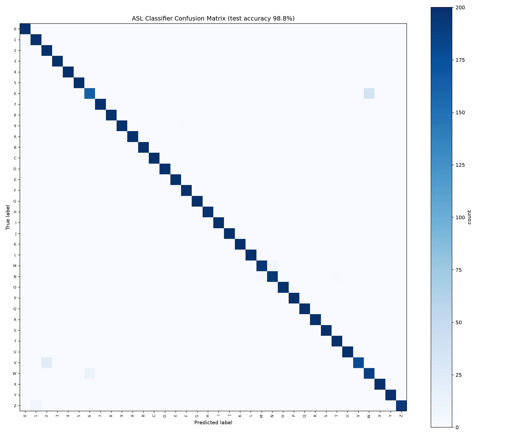

# SignCodec: Ultra-Low Bandwidth Semantic Communication for Sign Language

[](https://www.python.org/)
[](https://tensorflow.org/)
[](https://developers.google.com/mediapipe)
[](#empirical-compression-benchmarks)
[](#confusion-analysis--evaluation)
[](#sms-fallback-mode-no-internet-required)

**SignCodec** is a semantic communication framework that enables real-time sign language transmission over extreme bandwidth-constrained channels. Instead of transmitting pixel arrays or compressed video streams, SignCodec extracts 3D hand keypoints on the edge, encapsulates them into a **252-byte binary packet**, and transmits only the semantic coordinate state.

On the receiving end, a lightweight neural network decodes the keypoints into text in real time. For environments with zero internet access, SignCodec quantizes and encodes coordinates into **SMS text messages**, enabling sign communication over 2G cellular channels.

---

## Key Highlights

- **~3,600× Bandwidth Reduction**: Drops per-frame payload from ~921.6 KB (raw 640×480 RGB) to a **252-byte UDP packet** (63 × `float32`).
- **~360× Smaller than JPEG**: Outperforms standard lossy image compression frames (~90 KB JPEG at 95% quality).
- **Works over Plain SMS (No Internet Needed)**: 16-bit integer quantization compresses the payload to **126 bytes**, rendered as an ASCII Base64 string (172 characters) that transmits over standard cellular SMS.
- **High Accuracy & Real-time Edge Inference**:
  - **98.8% test accuracy** on 36-class American Sign Language (ASL: `0`–`9`, `A`–`Z`).
  - Native support for Indian Sign Language (**ISL / INCLUDE-50**, 50 classes).
  - Sub-50ms latency on commodity CPU/webcam hardware.
- **Temporal Stability Voting**: Implements majority-voting queue filtering to suppress mid-sign transitional noise and prevent jitter.

---

## Architecture & Pipeline

```
 [ Webcam Input ]
        │
        ▼
 [ MediaPipe HandLandmarker ]  ──>  Extracts 21 3D hand landmarks (x, y, z)
        │
        ▼
 [ Semantic Feature Vector ]   ──>  63 float32 coordinates
        │
        ├────────────────────────────────────────┬────────────────────────────────────────┐
        ▼                                        ▼                                        ▼
 [ UDP Stream Channel ]                   [ SMS Fallback Channel ]                [ Live Demo Dashboard ]
  • struct.pack("63f")                     • int16 quantization (scale: 10,000)   • Split-screen visualization
  • 252 bytes / packet                     • 126 bytes binary                     • Confidence readouts
  • Sent via UDP socket                    • Base64 encoded (172 chars)           • Live SMS string & bitrates
        │                                  • Cellular SMS gateway (Fast2SMS)              │
        ▼                                        │                                        │
 [ Receiver Client ]                             ▼                                        │
  • Listens on UDP port 5005               [ SMS Receiver / Decoder ]                     │
  • Unpacks 63 floats                      • Base64 decode + dequantize                   │
        │                                        │                                        │
        └────────────────────────────────────────┴────────────────────────────────────────┘
                                                 │
                                                 ▼
                                     [ Neural Semantic Decoder ]
                                      • Dense Classifier (Keras)
                                      • 63 inputs -> 128 -> 64 -> N classes
                                      • Softmax probabilities + stability filter
                                                 │
                                                 ▼
                                     [ Decoded Sign Language Text ]
```

---

## Empirical Compression Benchmarks

Measured using `measure_compression.py` on a standard 640×480 video frame:

| Format / Representation | Payload Size | Compression vs Raw | Compression vs JPEG | Channel Viability |
|:---|:---:|:---:|:---:|:---|
| **Raw Uncompressed Frame (RGB)** | **921,600 bytes** | 1× | — | Broadband / Local |
| **Lossless PNG Frame** | **~420,000 bytes** | ~2.2× | — | High-speed Wi-Fi / 4G |
| **Typical JPEG Frame (Quality 95)** | **~92,000 bytes** | ~10× | 1× | 3G / 4G Video Call |
| **SignCodec UDP Packet** | **252 bytes** | **~3,657×** | **~365×** | 2G / GPRS / Satellite / LoRa |
| **SignCodec SMS Payload (int16)** | **126 bytes** (172 chars b64) | **~7,314×** | **~731×** | **Offline SMS / GSM Cellular** |

> [!NOTE]
> Reconstruction error after int16 quantization is **$< 0.0001$**, which introduces zero degradation to classifier accuracy.

---

## Repository Structure

```
sign-codec/
├── app.py                      # Hugging Face Spaces Gradio interactive web application
├── cam_test.py                 # Quick webcam verification script
├── confusion_analysis.py       # Computes confusion matrix & error breakdown on test set
├── confusion_matrix.png        # Generated 36x36 ASL confusion matrix heatmap (98.8% accuracy)
├── demo_ui.py                  # Fullscreen unified demo UI (encoder + socket + decoder + stats)
├── extract_landmarks.py        # Real-time webcam landmark extractor & coordinate visualizer
├── filter_include50.py         # Subsets raw INCLUDE sign videos into the INCLUDE-50 benchmark
├── hand_landmarker.task        # MediaPipe HandLandmarker pretrained task asset
├── labels_asl.json             # ASL class mapping (36 classes: 0-9, A-Z)
├── labels_isl.json             # ISL class mapping (50 vocabulary signs)
├── measure_compression.py      # Empirical benchmark comparing raw, JPEG, PNG, and SignCodec
├── model_asl.keras             # Trained Keras model for ASL alphabet & digits
├── model_isl.keras             # Trained Keras model for ISL (INCLUDE-50)
├── packages.txt                # Linux apt dependencies for Hugging Face Spaces (libgl1)
├── process_asl_images.py       # Converts image datasets into 63-feature landmark CSVs
├── process_include_videos.py   # Samples video frames and extracts landmarks for INCLUDE
├── receiver.py                 # Standalone UDP receiver & live sign classification display
├── requirements.txt            # Python dependencies
├── sender.py                   # Standalone webcam landmark sender over UDP
├── sms_encode.py               # int16 quantization & Base64 SMS encoding/decoding & Fast2SMS API
├── train_classifier.py         # Neural network training script with early stopping & evaluation
└── datasets/
    ├── asl_landmarks.csv       # Extracted 63-feature landmark dataset for ASL
    └── include_landmarks.csv   # Extracted 63-feature landmark dataset for ISL (INCLUDE-50)
```

---

## Getting Started

### 1. Prerequisites

- Python 3.10 or higher
- A working webcam
- Windows, macOS, or Linux

### 2. Installation

Clone the repository and set up a virtual environment:

```bash
# Clone the repository
git clone https://github.com/Tanuj-Bhatt/SignCodec.git
cd SignCodec

# Create and activate virtual environment
python -m venv venv

# On Windows:
.\venv\Scripts\activate

# On Linux/macOS:
source venv/bin/activate

# Install dependencies
pip install -r requirements.txt
```

### 3. Verify Camera & Model Asset

Ensure your camera is detected and `hand_landmarker.task` is in the project root:

```bash
python cam_test.py
```

---

## Running the Applications

### Mode A: Browser Interactive Web Demo (Gradio / Hugging Face)

Run the full interactive web application in your browser (supports live webcam streaming with split-screen semantic decoding matching `demo_ui.py`):

```bash
python app.py
```
Then navigate to `http://localhost:7860` in your web browser.

---

### Mode B: Fullscreen Desktop Demo (OpenCV Native)

The native desktop demonstration of the system. Runs the webcam capture, edge landmark extraction, local loopback UDP socket transmission, neural network classifier, stability filter, and live SMS encoding in a single split-screen window:

```bash
python demo_ui.py
```

- **Left Panel**: Real-time webcam feed with 21 skeletal landmark overlays.
- **Right Panel**: Decoded character output, confidence score, packet counters, live compression multiplier, and live SMS payload representation.
- **Exit**: Press `ESC`.

---

### Mode C: Distributed Network Transmission (Sender & Receiver)

Simulate two separate machines or processes communicating across a local network or the internet.

1. **Start the Receiver** (run first to bind the UDP port):
   ```bash
   python receiver.py
   ```
2. **Start the Sender** (in another terminal):
   ```bash
   python sender.py
   ```

The sender captures camera frames at 5 Hz, extracts landmarks, packs 63 floats into 252 bytes, and sends them to `127.0.0.1:5005`. The receiver displays the decoded prediction.

---

### Mode D: SMS Fallback Protocol (Zero-Internet Channel)

Simulate or execute transmission over cellular text messages:

#### 1. Local Simulation (Verification of quantization & error bounds):
```bash
python sms_encode.py --mode simulate
```

Output:
```
=== Encoding proof ===
Original packet (float32, sender.py): 252 bytes
Quantized packet (int16):              126 bytes
Base64-encoded (SMS text):             172 characters
Standard SMS capacity: 160 chars (GSM-7) / 70 chars (Unicode)
SMS segments needed: 2
Round-trip max error after quantization: 0.000050 (negligible)
[SIMULATE MODE] No network call made. Encoding/decoding verified locally.
```

#### 2. Live SMS Transmission via Fast2SMS Gateway:
```bash
export FAST2SMS_API_KEY="your_api_key_here"   # On Windows: set FAST2SMS_API_KEY=your_api_key
python sms_encode.py --mode send --phone 9876543210
```

---

### Mode E: Empirical Compression Measurement

To generate a benchmark comparison on your hardware:

```bash
python measure_compression.py
```
This captures a live webcam frame, writes JPEG and PNG baselines to disk, and prints the exact byte measurements.

---

## Training & Dataset Pipelines

### 1. Generating Landmark Datasets from Raw Media

- **From ASL Images**:
  ```bash
  python process_asl_images.py --input path/to/asl_images/ --output datasets/asl_landmarks.csv
  ```

- **From INCLUDE Videos (ISL)**:
  ```bash
  # Step 1: Filter raw INCLUDE down to 50 target classes
  python filter_include50.py --videos_dir path/to/include_raw --output include50_videos

  # Step 2: Extract landmark coordinates from video middle frames
  python process_include_videos.py --input include50_videos --output datasets/include_landmarks.csv
  ```

### 2. Training the Neural Classifiers

Train on the 63-coordinate CSVs with early stopping and stratified train/test split:

```bash
# Train ASL Model (36 classes)
python train_classifier.py \
  --input datasets/asl_landmarks.csv \
  --output model_asl.keras \
  --labels labels_asl.json \
  --epochs 40

# Train ISL Model (50 classes)
python train_classifier.py \
  --input datasets/include_landmarks.csv \
  --output model_isl.keras \
  --labels labels_isl.json \
  --epochs 40
```

---

## Confusion Analysis & Evaluation

To evaluate per-class accuracy and generate the confusion matrix heatmap:

```bash
python confusion_analysis.py --input datasets/asl_landmarks.csv --output_image confusion_matrix.png
```

### Results on Held-Out Test Split (ASL)

- **Overall Test Accuracy**: **98.8%**
- **Model Size**: ~255 KB (Keras dense feedforward network)
- **Top Observed Confusions**: Minor confusion between visually similar static signs (e.g. `1` vs `T`, `6` vs `W`, `M` vs `N`).



---

## Packet Specifications

### 1. UDP Binary Stream Packet (252 Bytes)

```
Offset (Bytes)    Type       Field
000 - 003         float32    Landmark 0  (Wrist X)
004 - 007         float32    Landmark 0  (Wrist Y)
008 - 011         float32    Landmark 0  (Wrist Z)
...
240 - 243         float32    Landmark 20 (Pinky Tip X)
244 - 247         float32    Landmark 20 (Pinky Tip Y)
248 - 251         float32    Landmark 20 (Pinky Tip Z)
Total Size: 63 floats * 4 bytes = 252 bytes
```

### 2. Quantized SMS Payload (126 Bytes / 172 Base64 Chars)

$$\text{int16\_val} = \text{round}(\text{coord} \times 10,000)$$

- 63 signed 16-bit integers (`int16`) = 126 bytes.
- Standard Base64 encoding: $\lceil 126 / 3 \rceil \times 4 = 172$ ASCII characters.
- Transmittable over standard SMS text protocols without data connection.

---

## Technology Stack

- **Computer Vision & Tracking**: [Google MediaPipe HandLandmarker](https://developers.google.com/mediapipe/solutions/vision/hand_landmarker)
- **Deep Learning**: [TensorFlow / Keras](https://www.tensorflow.org/)
- **Image & Video Processing**: [OpenCV (cv2)](https://opencv.org/)
- **Data Engineering & Analysis**: [NumPy](https://numpy.org/), [Pandas](https://pandas.pydata.org/), [Scikit-Learn](https://scikit-learn.org/), [Matplotlib](https://matplotlib.org/)
- **Networking & Encoding**: Standard Python `socket` (UDP), `struct`, `base64`, [Fast2SMS API](https://www.fast2sms.com/)

---

## Roadmap

- [x] 21-point 3D hand landmark extraction on edge webcam.
- [x] 252-byte UDP packet transmission protocol.
- [x] 126-byte int16 SMS quantization and Base64 encoding.
- [x] 98.8% accurate ASL alphabet and number classifier.
- [x] INCLUDE-50 Indian Sign Language dataset pipeline and trained model.
- [x] Fullscreen adaptive split-screen demonstration UI.
- [ ] Multi-hand tracking support (42 keypoints for two-handed signing).
- [ ] Temporal sequence modeling (LSTM / Transformer) for continuous sentences.
- [ ] 3D avatar animation synthesis on the receiver end.

---

## License

This project is licensed under the MIT License — see the [LICENSE](LICENSE) file for details (or open source academic research use).
